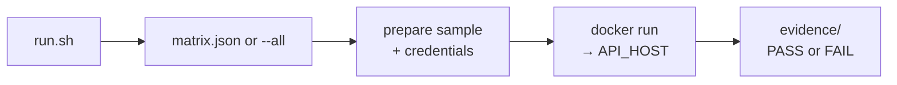

# Local code-sample smoke harness

Runs Engage docs samples across curl + C# / Java / JavaScript / PHP / Python / Ruby in Docker against a real host.

Keep credentials in `.env` only (gitignored). Runtime output under `evidence/` and `.work/` is also gitignored.

## Setup

```bash
cd local/sample-smoke
cp .env.example .env
# edit .env: API_KEY, API_SECRET, API_HOST (e.g. https://eu.app.api.sinch.com)
```

Requires Docker, `jq`, and `python3`.

## How it works



1. **run.sh** — loads `.env`, builds the language images, and drives the run.
2. **matrix.json or --all** — curated cells by default, or every sample under `spec/code_samples/`.
3. **prepare** — copies each docs sample into a workdir and injects API key/secret/host only.
4. **docker run** — executes the prepared sample in an isolated container against `API_HOST`.
5. **evidence** — records per-cell logs and a summary of PASS/FAIL.

## Run

From repo root:

```bash
./local/sample-smoke/run.sh
```

Or from this directory:

```bash
./run.sh
```

### Modes

| Command | What runs |
|---------|-----------|
| `./run.sh` | Curated cells in `matrix.json` (default) |
| `./run.sh --all` | Every sample under `spec/code_samples/` (~511) |

Optional filters (work with either mode):

```bash
./run.sh --lang python --method GET
./run.sh --lang curl,javascript --method POST,DELETE
./run.sh --all --lang curl,python
```

## Matrix

Default mode exercises one sample per verb (no path IDs required beyond credentials):

| Method | Sample |
|--------|--------|
| GET | `v1@webhooks@messages/get` |
| POST | `v1@messages/post` |
| PATCH | `v1@iam@signature_keys@enabled/patch` |
| DELETE | `v1@iam@signature_keys@enabled/delete` |

## Pass / fail

This harness checks that **code samples are executable**, not that the API returns a business-success body.

- **PASS:** snippet ran and an HTTP status (and usually a body) was observed. **4xx/5xx count as pass** — including responses caused by literal path placeholders such as `YOUR_CUSTOM_FIELD_ID`.
- **FAIL:** compile/runtime crash, missing sample file, or no recoverable HTTP response (e.g. DNS failure with empty output).

Path / query placeholders are **not** replaced with real IDs and tests are **not** chained to create resources. Only `YOUR_API_KEY`, `YOUR_API_SECRET`, and `YOUR_API_HOST` are injected.

Python samples that raise on 4xx are wrapped so the status/body still print.

## Evidence

Each run writes:

```
evidence/<run-id>/
  summary.txt          # PASS/FAIL lines include sample_file=<path relative to repo root>
  <cell>.log           # unique per sample, e.g. csharp__v1@messages__post.log
```

Use these logs as local test evidence.
